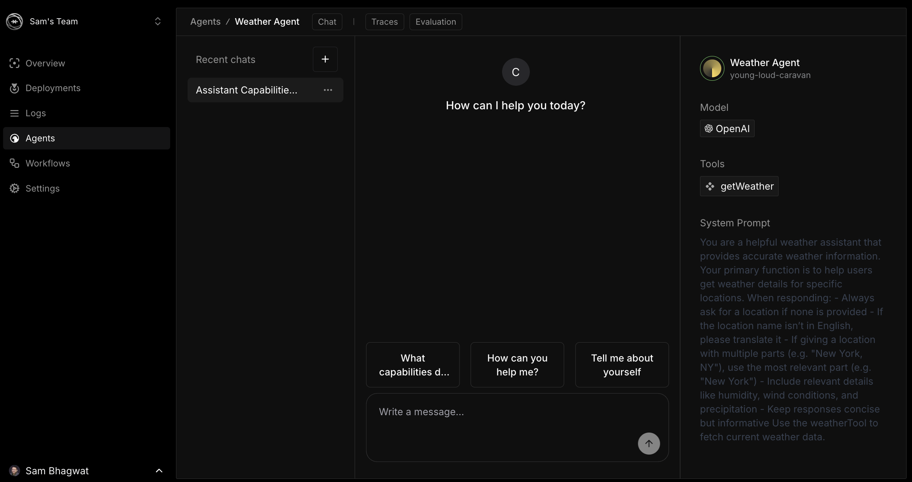

# Mastra Cloudにおける可観測性

Mastra Cloudは監視とデバッグのために実行データを記録します。エージェントとワークフローからトレース、ログ、ランタイム情報を取得します。

## エージェントインターフェース

エージェントインターフェースは、タブを通じてアクセス可能な3つの主要なビューを提供します：

1. **チャット**：エージェントをテストするためのインタラクティブなメッセージングインターフェース
2. **トレース**：詳細な実行記録
3. **評価**：エージェントのパフォーマンス評価

### チャットインターフェース

チャットタブは以下を提供します：

- デプロイされたエージェントとのインタラクティブなメッセージング
- ユーザークエリに対するシステム応答
- 提案されるプロンプトボタン（例：「どのような機能がありますか？」）
- メッセージ入力エリア
- ブランチインジケーター（例：「main」）
- エージェントのメモリ制限に関する注意事項

### エージェント設定パネル

右側のサイドバーにはエージェントの詳細が表示されます：

- エージェント名とデプロイメント識別子
- モデル情報（例：「OpenAI」）
- エージェントが利用できるツール（例：「getWeather」）
- 完全なシステムプロンプトテキスト

このパネルは、ソースコードを確認することなく、エージェントがどのように設定されているかを可視化します。

## トレースシステム

Mastra Cloudはエージェントとワークフローの対話のトレースを記録します。

### トレースエクスプローラーインターフェース

トレースエクスプローラーインターフェースは以下を表示します：

- すべてのエージェントとワークフローの対話
- 特定のトレースの詳細
- 入力と出力データ
- パラメータと結果を含むツールコール
- ワークフロー実行パス
- タイプ、ステータス、タイムスタンプ、エージェント/ワークフローによるフィルタリングオプション

### トレースデータ構造

各トレースには以下が含まれます：

1. **リクエストデータ**：エージェントまたはワークフローを開始したリクエスト
2. **ツールコール記録**：パラメータを含む実行中のツールコール
3. **ツールレスポンスデータ**：ツールコールからのレスポンス
4. **エージェントレスポンスデータ**：生成されたエージェントのレスポンス
5. **実行タイムスタンプ**：各実行ステップのタイミング情報
6. **モデルメタデータ**：モデル使用量とトークンに関する情報

トレースビューは実行全体を通じてすべてのAPIコールと結果を表示します。このデータはツールの使用法とエージェントのロジックフローのデバッグに役立ちます。

### エージェント対話データ

エージェント対話トレースには以下が含まれます：

- ユーザー入力テキスト
- エージェント処理ステップ
- ツールコール（例：天気APIコール）
- 各ツールコールのパラメータと結果
- 最終的なエージェントレスポンステキスト

## ダッシュボード構造

Mastra Cloudダッシュボードには以下が含まれています：

- プロジェクトのデプロイ履歴
- 環境変数の設定
- エージェント設定の詳細（モデル、システムプロンプト、ツール）
- ワークフローステップの可視化
- デプロイURL
- 最近のアクティビティログ

## エージェントのテスト

チャットインターフェースを使用してエージェントをテストします：

1. エージェントセクションに移動します
2. テストしたいエージェントを選択します
3. チャットタブを使用してエージェントと対話します
4. メッセージを送信し、応答を確認します
5. 一般的なクエリには推奨プロンプトを使用します
6. トレースタブに切り替えて実行の詳細を表示します

デフォルトでは、エージェントはセッション間で会話履歴を記憶しないことに注意してください。インターフェースには「エージェントは以前のメッセージを記憶しません。エージェントのメモリを有効にするには画像を参照してください」というメッセージが表示されます。

## ワークフローモニタリング

ワークフローモニタリングでは以下を表示します：

- ワークフローステップと接続の図
- 各ワークフローステップのステータス
- 各ステップの実行詳細
- 実行トレースレコード
- 複数ステップのプロセス実行（例：天気の検索後にアクティビティ計画を立てる）

### ワークフロー実行

特定のワークフロー実行を調査する際、詳細なステップとその出力を確認できます。

## ログ

ログセクションではアプリケーションに関する詳細情報を提供します：

- **時間**: ログエントリが作成された時刻
- **レベル**: ログレベル（info、debug）
- **ホスト名**: サーバー識別情報
- **メッセージ**: 詳細なログ情報（以下を含む）：
  - API初期化
  - ストレージ接続
  - エージェントとワークフローのアクティビティ

## 技術的特徴

オブザーバビリティシステムには以下が含まれます：

- **APIエンドポイント**：トレースデータへのプログラムによるアクセス
- **構造化トレースフォーマット**：フィルタリングとクエリ操作のためのJSON形式
- **履歴データストレージ**：過去の実行記録の保持
- **デプロイメントバージョンリンク**：トレースとデプロイメントバージョン間の相関関係

## デバッグパターン

- エージェントの動作変更をテストする際にトレースデータを比較する
- チャットインターフェースを使用してエッジケースの入力をテストする
- システムプロンプトを確認してエージェントの動作を理解する
- ツール呼び出しのパラメータと結果を調べる
- ワークフロー実行のステップシーケンスを確認する
- トレースのタイミングデータで実行のボトルネックを特定する
- エージェントバージョン間のトレースの違いを比較する

## サポートリソース

オブザーバビリティに関する技術的な支援については：

- [トラブルシューティングドキュメント]()を確認する
- ダッシュボードから技術サポートに連絡する
- [Discord開発者チャンネル](https://discord.gg/mastra)に参加する